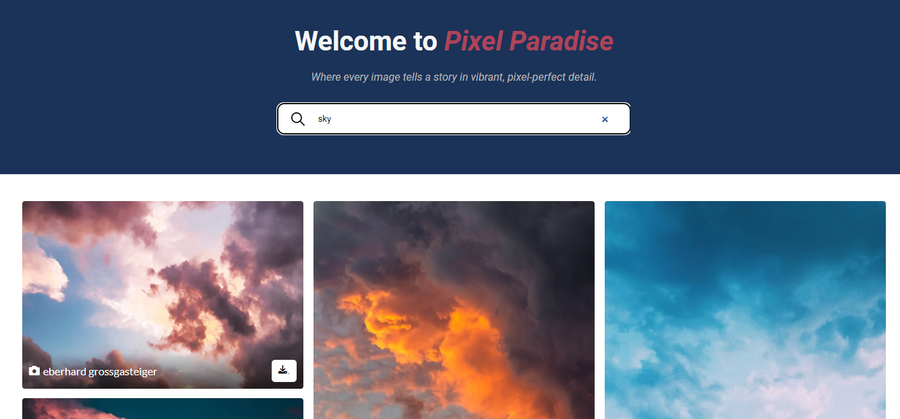

# PixelParadise
The project is built using HTML, CSS, and JavaScript. It also utilizes an external API to fetch images, allows users to <b>download images, search for specific images </b>, and view high-resolution versions.

### Visit Project at
<a href="https://ambersultan.github.io/PixelParadise/ ">https://ambersultan.github.io/PixelParadise/ </a>

## Features
<ul>
    <li><b>API Integration: </b>Display a grid of images retrieved from an external API.</li>
    <li><b>Download Functionality:</b>Allow users to download images by clicking on them directly from the gallery..</li>
    <li><b>Image Search:</b>Provide a search functionality to filter images based on user input.</li>
    <li><b>High-Resolution Images:</b>Enable users to view high-resolution versions of images.</li>
</ul>

## Screenshots

## Technologies Used
<ul>
    <li><b>HTML5:</b> Markup language for structuring the webpage.</li>
    <li><b>CSS3:</b> Styling language for enhancing the visual appearance.</li>
    <li><b>JavaScript:</b> Programming language for adding interactivity.</li>
    <li><b>External API:</b> <a href="https://www.pexels.com/api/">Pexels </a> API is used</li>
</ul>

## Usage
<ul>
    <li>Upon loading the webpage, the image gallery will be displayed.</li>
    <li>Use the search bar to filter images according to your choice.</li>
    <li>Click on any image to view it in high resolution.</li>
    <li>To download an image, simply click on the download button associated with the image.</li>
</ul>

